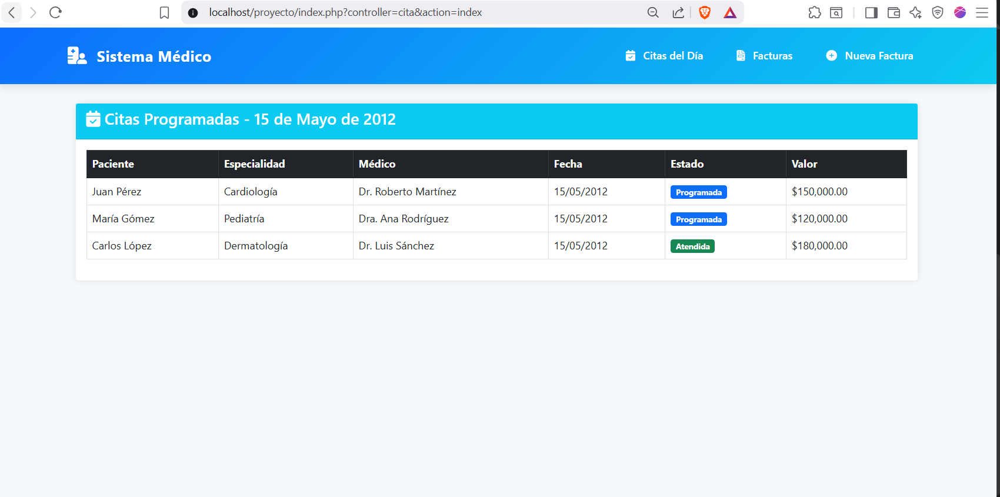
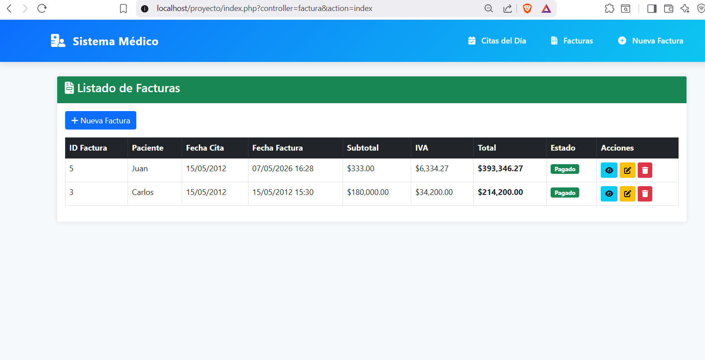
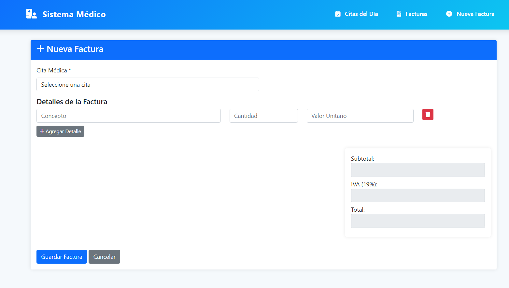
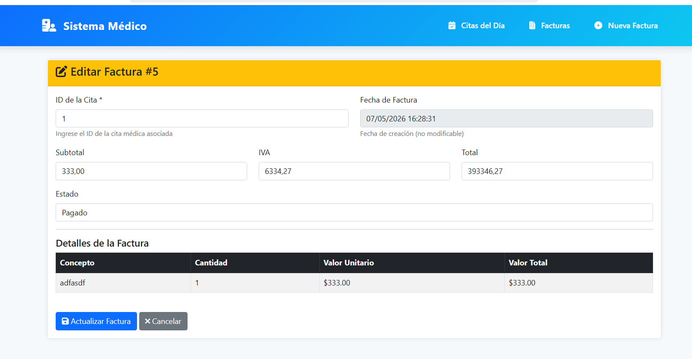

# Prueba Técnica - Vacante Ingeniero

Este repositorio contiene la solución de la prueba técnica correspondiente al proceso de selección.

## Tecnologías utilizadas

- PHP
- MySQL
- HTML
- CSS
- JavaScript
- Laragon

## Funcionalidades

- CRUD de pacientes
- Conexión a base de datos MySQL
- Consultas SQL solicitadas en la prueba
- Gestión de registros

## Capturas del proyecto

### Listado de pacientes



### listado de facturas



### Crear paciente




### Editar paciente



## Instalación

1. Clonar el repositorio:

```bash
git clone https://github.com/juan-sanchezp/prueba-tecnica-salud.git
```

2. Crear la base de datos utilizando el archivo `database.sql` ubicado en la raíz del proyecto.

3. Configurar las credenciales de conexión en el archivo correspondiente.

4. Ejecutar el proyecto en un entorno local como Laragon o XAMPP.

## Autor

Sebastián Sánchez